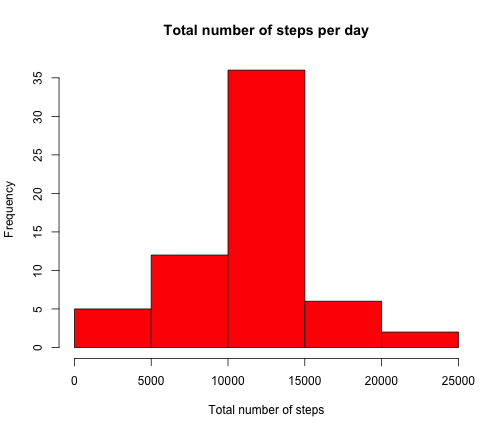

Assignment
========================================================


### Loading and preprocessing the data

-  Loading the data set

```r
data <- read.csv("activity.csv")
```

-  Creating new data set ignoring missing values 

```r
data2 <- na.omit(data)
```

### What is the mean total number of steps taken per day?

-  Histogram of the total number of steps taken each day

```r
x <- tapply(data2$steps, data2$date, FUN=sum)
x <- x[!is.na(x)]
hist(x,xlab = "Total number of steps", col = "red", main="Total number of steps per day")
```

 

-  Mean and median total number of steps taken per day

```r
mean(x)
```

```
## [1] 10766.19
```

```r
median(x)
```

```
## [1] 10765
```

### What is the average daily activity pattern?

-  Time series plot of the 5-minute interval (x-axis) and the average number of steps taken, averaged across all days (y-axis)

```r
x2 <- aggregate(data2$steps, by=list(interval=data2$interval), FUN=mean)
plot(x2, type='l', xlab = 'Interval', ylab = 'Average number of steps', main='Average number of steps, averaged across all days')
```

 

-  The 5-minute interval, on average across all the days in the dataset, which contains the maximum number of steps

```r
 x2[which.max(x2[,2]),1]
```

```
## [1] 835
```

### Imputing missing values

-  Total number of missing values in the dataset (i.e. the total number of rows with NAs)

```r
length(which(is.na(data$steps)))
```

```
## [1] 2304
```

-  Filling in all of the missing values in the dataset using the mean for each 5-minute interval

```r
data3 <- data
m = dim(data3)[1]
for (i in 1:m){
  if (is.na(data3[i,"steps"])){
        b <- data3[i,"interval"] 
        data3[i,"steps"] <- x2[x2$interval==b,][1,2]   
  }      
}
```

-  Histogram of the total number of steps taken each day

```r
h <- tapply(data3$steps, data3$date, FUN=sum)
hist(h,xlab = "Total number of steps", col = "red", main="Total number of steps per day")
```

 

-  Mean and median total number of steps taken per day

```r
mean(h)
```

```
## [1] 10766.19
```

```r
median(h)
```

```
## [1] 10766.19
```
We observe that including the missing values has an impact on the median. Specifically, the median and the mean values are now equal!

### Are there differences in activity patterns between weekdays and weekends?

-  Creating a new variable in the dataset with two levels 'weekday' and 'weekend' indicating whether a given date is a weekday or weekend day.

```r
days <- weekdays(as.Date(data3$date))
n <- length(days)
add <- vector(mode="character", length=n)
for (i in 1:n){
        if (days[i]=="Saturday" | days[i]=="Sunday"){
                add[i] <- "weekend" 
        }
        else{
                add[i] <- "weekday"
        }
}
data3 <- cbind(data3,add)
```

-  Panel plot containing a time series plot of the 5-minute interval (x-axis) and the average number of steps taken, averaged across all weekday days or weekend days (y-axis)

```r
dataWeekday <- data3[data3$add=="weekday",] 
dataWeekend <- data3[data3$add=="weekend",]  
x3 <- aggregate(dataWeekday$steps, by=list(interval=dataWeekday$interval), FUN=mean)
x4 <- aggregate(dataWeekend$steps, by=list(interval=dataWeekend$interval), FUN=mean)
par(mfrow=c(2,1))
plot(x3, type='l', xlab = 'Interval', ylab = 'Average number of steps', main='Average number of steps, averaged across all weekday days' )
plot(x4, type='l', xlab = 'Interval', ylab = 'Average number of steps', main='Average number of steps, averaged across all weekend days ')
```

 


